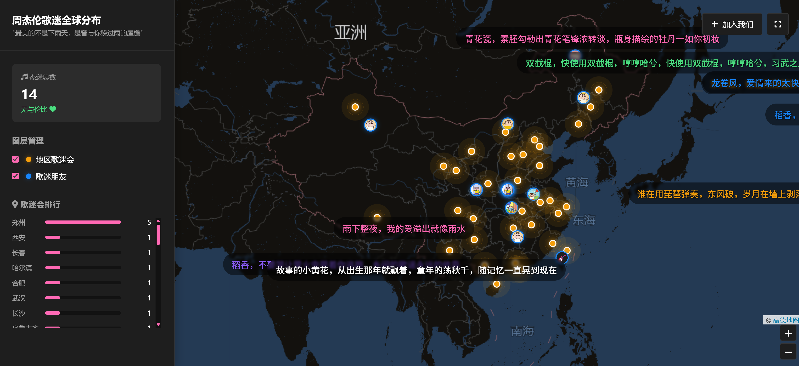

# 周杰伦歌迷全球分布地图

## 项目简介

这是一个展示周杰伦歌迷全球分布情况的互动地图应用，让世界各地的杰迷能够在地图上标记自己的位置，形成一个全球杰迷网络。



## 功能特点

- 🗺️ **全球地图展示**：基于Leaflet.js实现的交互式地图
- 👥 **用户加入**：杰迷可以在地图上标记自己的位置
- 📷 **头像上传**：支持上传个人头像或选择Emoji
- 📊 **数据可视化**：展示歌迷分布统计和排行
- 💬 **弹幕效果**：实时显示杰迷动态
- 🌍 **地区歌迷会**：展示各地歌迷组织分布

## 技术栈

### 前端
- HTML5 + CSS3
- JavaScript
- Leaflet.js (地图库)
- Font Awesome (图标库)

### 后端
- PHP
- JSON (数据存储)

## 项目结构

```
├── css/               # 样式文件
│   ├── add.css        # 加入页面样式
│   ├── danmaku.css    # 弹幕样式
│   └── style.css      # 主样式
├── js/                # JavaScript文件
│   ├── add.js         # 加入页面脚本
│   ├── danmaku.js     # 弹幕功能
│   ├── hubs.js        # 地区歌迷会数据
│   └── script.js      # 主页面脚本
├── imgs/              # 上传的头像图片
├── index.html         # 主页面
├── add.html           # 加入页面
├── save_user.php      # 保存用户数据
├── get_users.php      # 获取用户数据
├── users.json         # 用户数据存储
└── config.php         # 配置文件
```

## 快速开始

### 环境要求
- PHP 5.6+
- 支持静态文件服务的Web服务器（如Apache, Nginx等）

### 部署步骤

1. **克隆项目**
   ```bash
   git clone <项目地址>
   cd fans-map
   ```

2. **配置服务器**
   - 将项目部署到Web服务器根目录
   - 确保PHP文件具有执行权限
   - 确保`users.json`文件和`imgs`目录具有写入权限

3. **访问应用**
   - 打开浏览器，访问 `http://localhost/fans-map`
   - 点击「加入我们」按钮添加你的位置

## 使用指南

### 查看地图
1. 打开主页面 `index.html`
2. 浏览全球杰迷分布
3. 使用图层控制切换显示歌迷会和个人歌迷
4. 查看歌迷会排行榜

### 加入杰迷网络
1. 点击「加入我们」按钮进入添加页面
2. 填写昵称（最多10个字）
3. 选择头像（上传图片或选择Emoji）
4. 在地图上点击选择你的位置
5. 点击「加入网络」按钮提交

## 数据结构

### 用户数据 (users.json)

```json
[
  {
    "nickname": "给我五毛",
    "avatar": "https://i1.go2yd.com/image.php?url=YD_cnt_221_01qx4IePZfUh",
    "lat": 26.999475955405558,
    "lng": 113.63265420961241,
    "timestamp": 1769332601762
  }
]
```

### 地区歌迷会数据 (hubs.js)

```javascript
const hubs = [
  {
    name: "北京歌迷会",
    members: 1200,
    lat: 39.9042,
    lng: 116.4074
  },
  // 更多歌迷会...
];
```

## 浏览器兼容性

- Chrome 60+
- Firefox 55+
- Safari 12+
- Edge 79+

## 贡献指南

欢迎对项目进行贡献！如果你有任何改进建议或发现了bug，请：

1. Fork 本项目
2. 创建你的特性分支 (`git checkout -b feature/amazing-feature`)
3. 提交你的更改 (`git commit -m 'Add some amazing feature'`)
4. 推送到分支 (`git push origin feature/amazing-feature`)
5. 开启一个Pull Request

## 许可证

本项目采用 MIT 许可证 - 详见 [LICENSE](LICENSE) 文件

## 致谢

- [Leaflet.js](https://leafletjs.com/) - 开源地图库
- [Font Awesome](https://fontawesome.com/) - 图标库
- 所有参与贡献的杰迷朋友

---

> "最美的不是下雨天，是曾与你躲过雨的屋檐"
> — 周杰伦

希望这个项目能让全球的杰迷朋友更加紧密地联系在一起！🎵